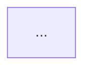

# Open rich PR (to main)

## When invoked

1. Confirm or detect the integration branch (`main` or `master` via `gh repo view` / remotes). Call it **base**.
2. Confirm the head branch (current branch, often `develop`). Call it **head**. Never force-push base.
3. Ensure work is committed on head (ask if the human did not request commit; if they asked to push/PR the current work, commit first with a clear message).
4. `git push -u origin HEAD` (no `--force` unless the human explicitly asks).
5. Open PR with `gh pr create --base <base> --head <head>` and a **full body** (below). Return the PR URL.

## PR body template (required sections)

Use a HEREDOC / here-string. Include **Mermaid** in fenced `mermaid` blocks. Prefer Chinese for client/杂活 repos when the human writes in Chinese; keep identifiers (paths, branch names) literal.

```markdown
## Summary
- …

## Context / 相关知识
- Why this change (traffic, trust/crawl, product ask, …)
- Links to skills/steering/docs touched (paths only; no secrets)

## Changes / 修改点
- Bulleted file areas and behavior changes

## Architecture / flow (Mermaid)


Optional second diagram (sequence / state) when helpful.

## Side effects / 副作用
- Runtime, SEO, i18n, deploy, analytics, breaking URL/host changes
- What will NOT improve (honest)

## Test plan
- [ ] …

## Stakeholders / 需沟通对象
- Role + what to tell them (ops deploy, owner NAP confirm, ads, …)
- Do not invent personal names; use roles unless the human named someone
- When the PR touches host/canonical/sitemap: **agent must also ask the human in chat** to confirm hoster env `NEXT_PUBLIC_BASE_URL` (or equivalent) = final live origin; put that ask under Stakeholders in the PR body

## Rollback
- How to revert / feature flags if any
```

## Quality bar

- Diff the full `base...HEAD` history, not only the last commit.
- Do not put secrets, `.env`, or real NAP dumps into the PR if the human asked to keep them private; refer to “site contact module” instead when appropriate.
- Do not claim CI is green unless checked.
- If PR already exists for this head, update body with `gh pr edit` or comment—do not open duplicates.
- For SEO/host PRs: do not close the loop without an explicit human answer on the public origin env.

## Anti-patterns

- One-line PR (“fix stuff”).
- No Mermaid when the change has a clear pipeline (trust→crawl→convert).
- Pushing directly to base / force-pushing shared base.
- Skipping “副作用” and “需沟通对象”.
- Assuming code fallbacks make `NEXT_PUBLIC_BASE_URL` unnecessary to ask about.