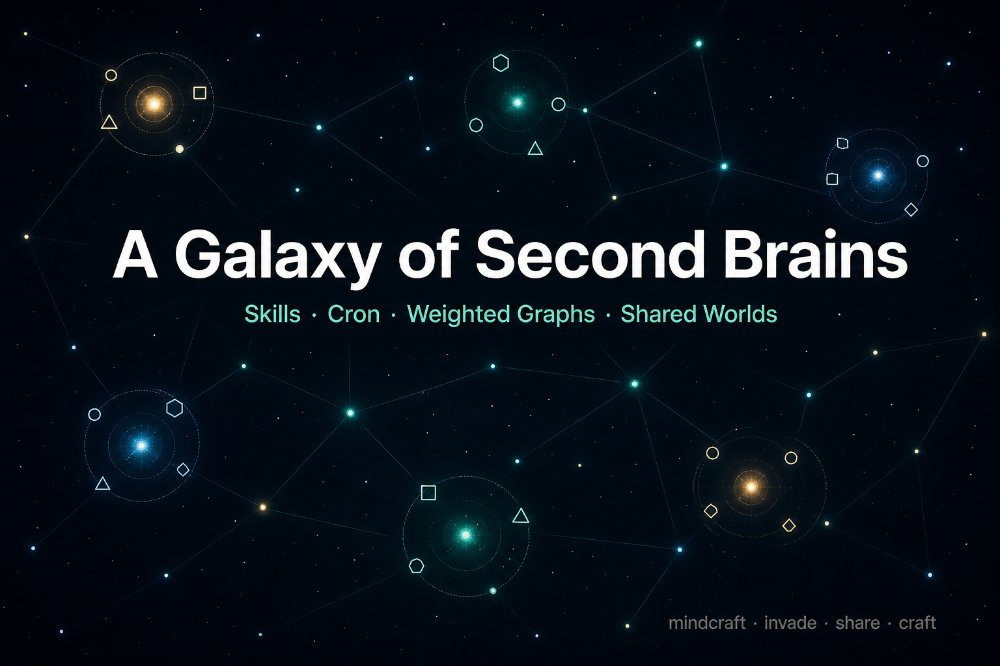
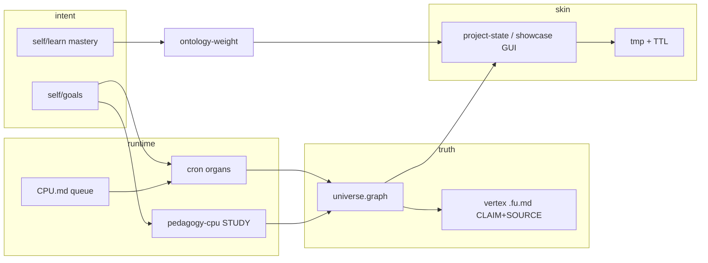

# mindcraft

**A galaxy of second brains** — not another vault app.



| | |
|--|--|
| **EN** | Runnable personal OS: organs + weighted ontology. Outlook: many minds invade shared worlds — share knowledge, share skills, optionally compete. GUI is spun up by the agent workflow on demand. |
| **DE** | Lauffähiges persönliches OS: Organe + gewichtete Ontologie. Ausblick: viele Minds teilen Welten — Wissen, Skills, optional Wettkampf. GUI entsteht on-demand aus dem Agent-Workflow. |
| **中文** | 可运行的个人 OS：器官 + 加权本体。展望：多个 mind 入侵共享世界——共享知识与 skill，可协作/对战。GUI 由 agent 工作流按需生成。 |

MIT · Local-first · Markdown + graph as source of truth · See [`ROOT.md`](ROOT.md) for the control language.

---

## Outlook

Most “AI second brains” are **one person → one note vault → better search**.

This project aims at a **galaxy**:

1. **Star (one mind)** — a complete runnable organism: `skills`, `cron`, `self`, life queue (`CPU.md`), study surface, inflow, schedule, routine.
2. **Galaxy (many minds)** — invade a shared world: **share knowledge** (sourced graph fragments), **share skills** (executable procedures), optionally **collaborate or compete**.
3. **Skin (GUI)** — not a product shell. Views are **generated on demand** by the agent workflow and may expire (`tmp/` + TTL).

Game [Mindcraft](https://github.com/mindcraft-bots/mindcraft) puts LLM bots into Minecraft. Here the craftable world is the **person’s OS**; Minecraft-style arenas are one possible *skin*, not the identity of the system.

---

## What it is / is not

| Is | Is not |
|----|--------|
| Personal **operating system** for learning + life + work | Another Obsidian/Notion clone |
| **Ontology** of essence (`pedagogy/`) with cited CLAIMs | A CV dumped into a graph |
| **Weighted attention** from goals + mastery + plan + zeitgeist | “Whatever the LLM remembers this chat” |
| **PROBE → ANSWER → ASSESS** study protocol | Auto-filled cheat sheets |
| Organs with hard boundaries | One flat folder of markdown |
| Privacy in `.private/` | PII in the public ontology |
| Outlook: multi-mind **share / invade / contest** | Shipped multiplayer product (yet) |

Comparables for the *single-mind* layer: OneBrain, obsidian-second-brain, Letta, Ariadne — skills + schedules + markdown memory.  
**Difference:** first-class organs, gremlin-lite ontology with SOURCE, live weights, life runtime (train / routine / today), ephemeral GUI.

---

## Architecture

### Organ map

```text
ROOT.md                 control language + directory contract
├── CPU.md              life run queue (AGENT · SCHEDULE · NOTE TODAY · TODO)
├── pedagogy/           ontology (essence) + study interface
│   ├── universe.graph.md
│   ├── ontology.fu.md
│   ├── pedagogy-cpu.fu.md
│   └── <branch>/<Vertex>.fu.md
├── self/               particulars of intent & body (goals, learn, training, routine, endurance)
├── cron/               gatherers & maintain organs (*.fu.md + *.py)
├── inflow/             away-loop news dump → drip when back
├── schedule/           calendar harvest + enrich
├── skills/             agent libraries (viz, video, showcase…)
├── .cursor/skills/     Cursor Agent Skills (SKILL.md)
├── mezzanine/          ingest notes (not claims)
├── .private/           gitignored pinpointables (NAP, Amt, clinics…)
├── tmp/                on-demand deliverables (HTML, PDF, MP4) + ttl.toon.md
└── recycle/            janitor bin for non-markdown sweep
```

### Data flow (single mind)



### Organs (KIND ≠ one view)

| Organ | Store | Role |
|-------|--------|------|
| **Life queue** | `CPU.md` | What to spawn *this tick* |
| **Study** | `pedagogy-cpu.fu.md` | PROBE / ANSWER / PLAN / DAY |
| **Ontology** | `universe.graph.md` + bodies | What *is* (not who you are) |
| **Self** | `self/*.toon.md` | Goals, mastery, training, routine, endurance |
| **Cron** | `cron/*` | News, harvest, weights, janitor, routine-enrich… |
| **Inflow** | `inflow/` | Capture while away; drip when back |
| **Schedule** | `schedule/` | Calendar facts with SOURCE |
| **Skills** | `skills/` + `.cursor/skills/` | Libraries the agent may invoke |
| **Skin** | `tmp/pedagogy/*` | Dynamic HTML / media; not the store |

---

## Design

### Principles

1. **Organs over soup** — each directory is a KIND. Do not flatten life, study, and ontology into one graph view.
2. **Essence ≠ particulars** — domains live in `pedagogy/`; identity, salary, clinic streets stay in `.private/` / gitignored self files.
3. **SOURCE or silence** — new edges and tips need a URL or path. Do not invent ANSWER, last_done, or attendance.
4. **PROBE first** — study starts with one open question. Empty ANSWER stays empty until the human writes.
5. **Weight is computed** — attention on the graph is not vibes; it is dims from hire / plan / study / zeitgeist / Maslow heuristic + mastery mirror (`cron/ontology-weight.py` → `pedagogy/_learn/weights.toon.md`).
6. **GUI is disposable** — `python skills/project-state-viz.py --serve` builds a purpose-mode skin; `tmp/ttl.toon.md` lets janitor expire siblings.
7. **Galaxy-ready boundaries** — shareable units are sourced V/E fragments and skill packages; private bags never cross the membrane by default.

### Control language (`fu`)

- Files: nested unordered lists; first token after `- ` is a **CAPITAL TAG** (see `ROOT.md`).
- `AGENT $id=… $prompt=…` is a real spawn declaration, not a comment.
- `STORE PATH` binds persistence; library `.fu.md` under `skills/` / `cron/` does not auto-spawn unless `CPU.md` or `pedagogy-cpu` names them.

### Graph

- `V id kind=… gloss=… body=…`
- `E from LABEL to … SOURCE=…`
- Labels: `ISA` `PARTICIPATES` `INFORMS` `RECEIVES` `STUDIES` `GROUNDS_IN` `APPLIES` `ENACTS` `MEDIATES` `TRANSMITS` `CONTRADICTS`
- Bodies hold `CLAIM` / `MEDIA` / `SOURCE`. No image bytes in vertices.

### Study loop

```text
GOALS.north → PLAN NOW/NEXT
     → PROBE (one question)
     → human ANSWER (never invented)
     → ASSESS grasp → E Study STUDIES
     → PLAN reorder / weights refresh
```

### Today merge

When asked “what should I do today”, merge: `CPU NOTE TODAY` + training/injury + **routine** (daily + due preventive) + harvest + PLAN/PROBE + endurance fog — via `project-state-viz --purpose today` (and `routine-enrich --today`).

---

## Interview banks → ontology (bottom-up)

Public Agent interview theme banks (e.g. [面灵 2026 Agent 155](https://www.mianlingai.com/topics/ai-agent-interview-questions-2026/)) feed **theme → vertex** maps, not answer dumps.

| Store | Role |
|-------|------|
| `pedagogy/_learn/mianling-agent-2026.toon.md` | Nine themes → vertices + hire heat |
| `pedagogy/_learn/interview-prep-strategy.toon.md` | Retrieval-first prep + angle layers + humanity/history membrane |
| `cron/interview-bank-enrich.py` | `--status` / `--gap` / `--zeitgeist` / `--stamp` |
| `cron/interview-anchor.py` | Amit title bank → DAY slice (titles only) |

Prep is **PROBE → cold ANSWER → ASSESS → multi-turn**, then open SOURCE. Ontology holds Essence; **AutobiographicalMemory** / **History** hold how personal and collective narrative are stored and assembled — particulars stay in `.private/`.

## Methods (how work actually runs)

| Move | How |
|------|-----|
| Spawn work | Put `AGENT` / `SCHEDULE` on `CPU.md`; runtime reads `ROOT` → `CPU` → optional `pedagogy-cpu` |
| Learn | Empty PROBE on PLAN NOW; `learn-enrich` / interview-anchor for banks — titles + SOURCE only |
| Enrich ontology | Cron gatherers APPEND sourced V/E; maintain one organ per tick |
| Away capture | `inflow-news` → `DUMP.md`; human back → `dump-drip` (PII → `.private` first) |
| Attention | `python cron/ontology-weight.py` |
| See state | `python skills/project-state-viz.py --purpose today\|ontology\|inflow\|… [--serve]` |
| Deliver media | Skills write `tmp/`; stamp TTL; janitor may delete siblings after lapse |

### Useful commands

```bash
# Weighted ontology + interactive skins (needs --serve for drawers / notes)
python cron/ontology-weight.py
python skills/project-state-viz.py --purpose today
python skills/project-state-viz.py --purpose ontology --serve
python skills/project-state-viz.py --purpose inflow --serve

# Routine slice
python cron/routine-enrich.py --today
python cron/routine-enrich.py --due
```

---

## Galaxy outlook (design target)

Not shipped as a network product yet. The **membrane** is designed so multiplayer can attach without rewriting the single-mind core:

| Exchange | Unit | Rule of thumb |
|----------|------|----------------|
| Share knowledge | Sourced `V`/`E` packs + optional body excerpts | Fork with SOURCE; no silent merge of `.private` |
| Share skills | `.cursor/skills/<name>/` or `skills/*.fu.md` + runner | Executable procedure, versioned like code |
| Invade / contest | Shared world session (digital or embodied skin) | Score = mastery progress, sourced claims, or arena rules — not vanity metrics |
| Skin | Dynamic GUI / game client | Generated for the session; store stays in each mind’s repo |

**Invade** ≠ only combat. It means: enter a shared context carrying your weighted graph and skill surface — teach, fork, collaborate, or compete.

---

## Status

- **Solid today:** single-mind OS, ontology + study protocol, cron organs, inflow/schedule, routine, weighted viz skins, video/PDF kits.
- **Outlook:** multi-mind share / invade / galaxy protocols and session skins.

Canonical contracts: [`ROOT.md`](ROOT.md), [`pedagogy/ontology.fu.md`](pedagogy/ontology.fu.md), [`CPU.md`](CPU.md).

## License

[MIT](LICENSE) © 2026 zhutoutoutousan
